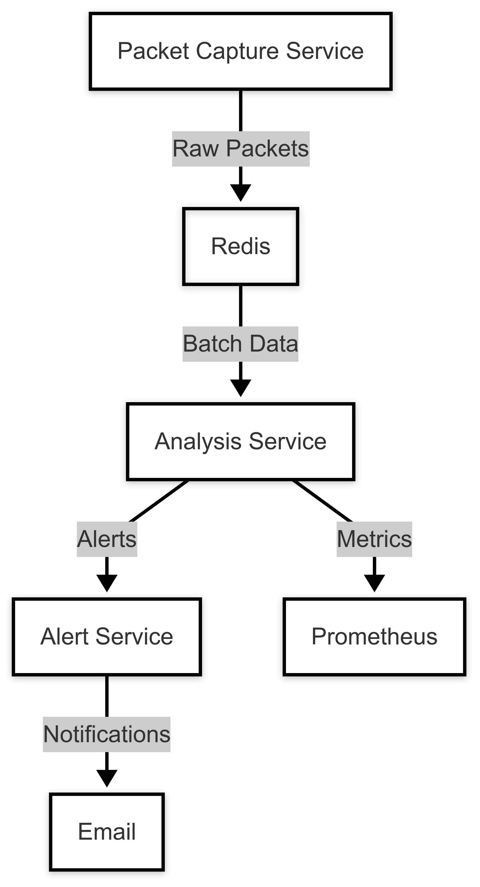

# Network IDS with Threat Intelligence

An Intrusion Detection System (IDS) that combines real-time packet capture with threat intelligence APIs.

## Table of Contents
- [Prerequisites](#prerequisites)
- [Setup Instructions](#setup-instructions)
- [Architecture](#architecture)
- [API Documentation](#api-documentation)
  - [Analysis Service](#analysis-service)
  - [Capture Service](#capture-service)
- [Configuration](#configuration)
- [Monitoring](#monitoring)

## Prerequisites

- Go (latest stable version)
- Node.js (v18+)
- Redis
- Npcap (for Windows)
- Docker (optional)

## Setup Instructions

1. Install Npcap:
   - Download from [Npcap website](https://npcap.com/#download)
   - Install with WinPcap compatibility mode

2. Install Redis:
   ```bash
   # Using Docker
   docker run --name redis -p 6379:6379 -d redis
   ```

3. Start the services:
   ```bash
   # Using Docker Compose
   docker-compose up -d
   ```

## Architecture



### Reputation Scoring System

The IDS uses a sophisticated composite reputation scoring system that combines multiple threat intelligence sources:

#### Multi-Source Integration
- **IsMalicious API** (40% weight)
  - Primary source for real-time threat detection
  - Provides detailed reputation metrics and source categorization

- **AbuseIPDB** (30% weight)
  - Confidence scoring (0-100)
  - Community-driven abuse reports
  - Historical abuse data

- **VirusTotal** (30% weight)
  - Multi-engine detection results
  - File and URL scanning capabilities
  - Comprehensive threat intelligence

#### Scoring Algorithm
1. **Data Normalization**
   - All scores normalized to 0-1 scale
   - AbuseIPDB scores divided by 100
   - VirusTotal detections ratio calculated

2. **Weighted Scoring**
   ```typescript
   compositeScore = (
     isMalicious * 0.4 +
     abuseIPDB * 0.3 +
     virusTotal * 0.3
   )
   ```

3. **Alert Thresholds**
   - CRITICAL: Score >= 0.85
   - HIGH: Score >= 0.70
   - MEDIUM: Score >= 0.50
   - LOW: Score >= 0.30

4. **Minimum Requirements**
   - At least 2 sources must report malicious activity
   - Composite score must exceed LOW threshold (0.30)

#### Alert Generation
Alerts include:
- Composite reputation score
- Individual source scores
- Number of confirming sources
- Detailed reputation data from each source
- Traffic pattern analysis
- Packet metadata

## API Documentation

### Analysis Service

#### Packet Analysis API

**Analyze Packet**
```http
POST /api/analysis/packet
Content-Type: application/json

{
    "src_ip": "192.168.1.100",
    "dst_ip": "10.0.0.1",
    "protocol": "TCP",
    "src_port": 12345,
    "dst_port": 80,
    "packet_size": 1024,
    "packet_type": "SYN",
    "payload_size": 512,
    "timestamp": "2024-03-10T15:00:00Z"
}
```

**Response**
```json
{
    "alerts": [
        {
            "id": "PORT_SCAN-1234567890",
            "severity": "high",
            "type": "PORT_SCAN",
            "message": "Port scan detected from 192.168.1.100",
            "timestamp": "2024-03-10T15:00:00Z"
        }
    ]
}
```

**Get Service Status**
```http
GET /api/analysis/status
```

**Response**
```json
{
    "status": "running",
    "uptime": 3600,
    "metrics": {
        "packetsProcessed": 1000,
        "alertsGenerated": 5,
        "processingTime": {
            "avg": 0.05,
            "p95": 0.1
        }
    }
}
```

**Get Metrics**
```http
GET /metrics
```

Response: Prometheus-formatted metrics

### Capture Service

#### Configuration API

**Update Capture Config**
```http
POST /api/capture/config
Content-Type: application/json

{
    "interface": "eth0",
    "promiscuous": true,
    "filters": {
        "ports": [80, 443, 53],
        "protocols": ["TCP", "UDP", "ICMP"]
    }
}
```

**Get Capture Status**
```http
GET /api/capture/status
```

**Response**
```json
{
    "status": "running",
    "interface": "eth0",
    "packetsCaptures": 5000,
    "uptime": 3600,
    "filters": {
        "active": true,
        "ports": [80, 443, 53],
        "protocols": ["TCP", "UDP", "ICMP"]
    }
}
```

## Configuration

### Analysis Service Environment Variables
```env
# Server Configuration
PORT=3000
LOG_LEVEL=info

# Redis Configuration
REDIS_URL=redis://localhost:6379

# Analysis Configuration
ANALYSIS_WORKERS=4
BATCH_SIZE=100

# Metrics
METRICS_PORT=9090

# Alert Configuration
ALERT_DB=2
ALERT_TTL=3600
ALERT_AGGREGATION_WINDOW=300

# Email Configuration
EMAIL_HOST=smtp.gmail.com
EMAIL_PORT=587
EMAIL_SECURE=true
EMAIL_USER=your-email@gmail.com
EMAIL_PASSWORD=your-app-specific-password
```

### Capture Service Environment Variables
```env
# Capture Configuration
INTERFACE=eth0
PROMISCUOUS_MODE=true
SNAPSHOT_LENGTH=65535

# Redis Configuration
REDIS_URL=redis://localhost:6379
BATCH_SIZE=100
BATCH_INTERVAL=1000

# Metrics
METRICS_PORT=9091
```

## Monitoring

### Available Metrics

1. **Analysis Service**
   - `packets_processed_total`: Total packets analyzed
   - `alerts_generated_total`: Total alerts generated
   - `packet_processing_duration_seconds`: Processing time histogram
   - `packet_size_bytes`: Packet size distribution

2. **Capture Service**
   - `packets_captured_total`: Total packets captured
   - `batch_size_packets`: Batch size histogram
   - `capture_errors_total`: Total capture errors
   - `network_bandwidth_bytes`: Network bandwidth usage

### Grafana Dashboard

A sample Grafana dashboard is available in `/config/grafana/dashboards/ids.json`

## Development

### Running Tests
```bash
# Analysis Service
cd analysis-service
npm test

# Capture Service
cd capture-service
go test ./...
```

### Building
```bash
# Capture Service
cd capture-service
go build
# Analysis Service
cd analysis-service
npm run build
```

## Contributing

Please read [CONTRIBUTING.md](CONTRIBUTING.md) for details on our code of conduct and the process for submitting pull requests.

## License

This project is licensed under the MIT License - see the [LICENSE](LICENSE) file for details.

