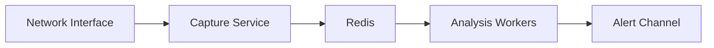

# IDS Implementation Progress Report - Phase 1

## Overview
Phase 1 focused on establishing the core infrastructure for a network Intrusion Detection System (IDS) with real-time packet capture and analysis capabilities.

## Components Implemented

### 1. Packet Capture Service (Go)
- **Core Functionality**
  - Real-time packet capture using gopacket
  - Smart network interface detection and selection
  - Comprehensive packet parsing (IP, ports, protocol, payload)
  - Batch processing with configurable parameters
  ```go
  const (
      batchSize    = 100
      batchTimeout = 500 * time.Millisecond
  )
  ```

- **Performance Optimizations**
  - Batch processing to reduce Redis load
  - Efficient packet serialization
  - Rate limiting to prevent system overload
  - Memory-efficient packet handling

- **Configuration Management**
  ```go
  type Config struct {
      Interface   string
      RedisAddr   string
      SnapshotLen int32
      Promiscuous bool
      Timeout     time.Duration
  }
  ```

- **Monitoring & Statistics**
  - Packet statistics tracking
  - Dropped packet monitoring
  - Performance metrics logging

### 2. Analysis Worker (Node.js)
- **Core Analysis Engine**
  - Multi-threaded packet analysis
  - Worker pool based on CPU cores
  - Connection pooling for Redis
  ```javascript
  const NUM_WORKERS = os.cpus().length;
  const pool = await createRedisPool(5);
  ```

- **Detection Rules Implemented**
  ```javascript
  // HTTPS Traffic Detection
  if (packet.dst_port === 443 || packet.src_port === 443)

  // Large Payload Detection
  if (packet.payload_size > 500)

  // High Frequency Connection Detection
  if (packet.src_ip === state.lastSourceIP && 
      Date.now() - state.lastPacketTime < 100)
  ```

- **State Management**
  - Worker-local state tracking
  - Thread-safe packet processing
  - Clean shutdown handling

### 3. Data Flow Architecture


### 4. Testing Infrastructure
- **Unit Tests**
  - Redis connection testing
  - Packet serialization
  - Worker thread functionality
  ```javascript
  describe('Worker Thread Tests', () => {
      test('Worker processes packets correctly', (done) => {
          // Test implementation
      });
  });
  ```

- **CI/CD Pipeline**
  - GitHub Actions workflow
  - Automated testing
  - Build verification

### 5. DevOps Setup
- **Docker Integration**
  - Containerized services
  - Docker Compose configuration
  - Volume management
  ```yaml
  services:
    redis:
      image: redis:latest
    capture-service:
      build: ./capture-service
    analysis-worker:
      build: ./analysis-worker
  ```

## Performance Metrics
- Batch processing: 100 packets per batch
- Processing delay: 500ms maximum
- Worker threads: Scales with CPU cores
- Connection pool: 5 Redis connections

## Current Limitations
1. Basic analysis rules only
2. Limited threat detection capabilities
3. No persistent storage
4. Basic monitoring only

## Next Steps (Phase 2)
1. **Enhanced Analysis**
   - Port scanning detection
   - Protocol anomaly detection
   - Threat intelligence integration

2. **Monitoring & Metrics**
   - Prometheus integration
   - Grafana dashboards
   - Performance monitoring

3. **Security Enhancements**
   - TLS for Redis
   - Access control
   - Input validation

4. **Scalability**
   - Horizontal scaling
   - Load balancing
   - Data persistence

## Technical Debt
1. Need more comprehensive testing
2. Error handling could be more robust
3. Configuration management needs centralization
4. Logging system needs standardization

## Dependencies
- Go v1.21
- Node.js v20
- Redis v4.6.13
- gopacket v1.1.19
- Docker & Docker Compose

## Documentation Status
- Basic README
- Code comments
- Configuration guide
- Setup instructions

This concludes Phase 1 of the IDS implementation, establishing a solid foundation for future enhancements. 